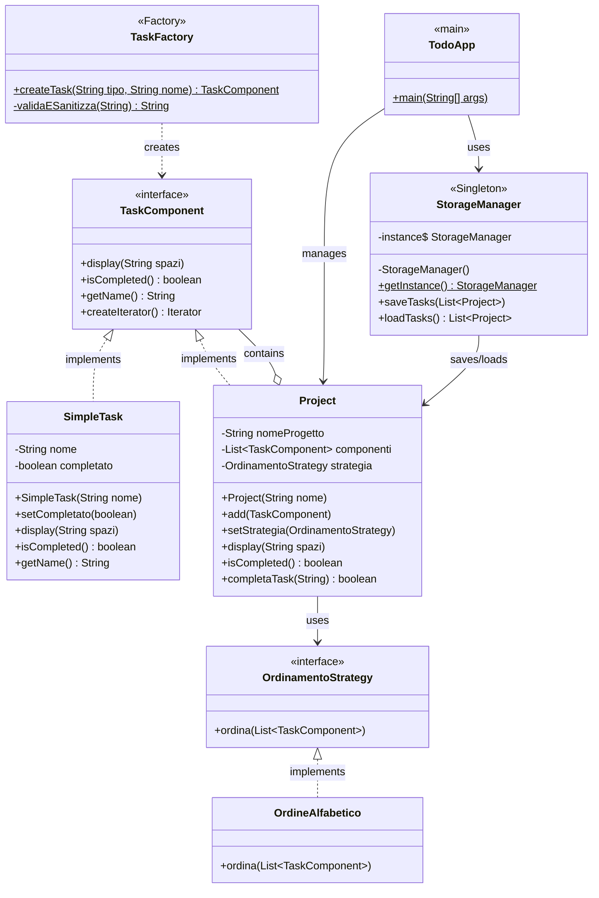

# TodoApp - Task Management System

## 📋 Table of Contents
1. [Application Overview]
2. [Technologies and Design Patterns]
3. [Setup and Execution]
4. [UML Diagrams]
5. [Known Limitations and Future Work]
6. [Test Suite]

---

## 📱 Application Overview

### Description
TodoApp is a command-line task management system that allows users to organize their work through projects and tasks. The application implements multiple design patterns to ensure maintainability, extensibility, and security.

### Core Functionality

#### Task Management
- **Add Tasks**: Create simple tasks with validated names
- **Mark as Completed**: Toggle task status between pending `[ ]` and completed `[X]`
- **Remove Completed**: Clean up finished tasks from projects
- **Task Validation**: Automatic sanitization against injection attacks

#### Project Organization
- **Multiple Projects**: Create and manage separate project containers
- **Hierarchical Structure**: Projects can contain tasks and sub-projects (Composite pattern)
- **Project Switching**: Navigate between different projects dynamically
- **Project Reset**: Clear all tasks from a project

#### Sorting Strategies
- **Alphabetical Order**: Sort tasks A-Z by name
- **Insertion Order**: Maintain original creation order
- **Dynamic Switching**: Change sorting strategy at runtime

#### Data Persistence
- **Auto-save**: Automatic persistence on critical operations
- **Manual Save**: Explicit save command
- **Auto-load**: Restoration of previous session on startup
- **Error Recovery**: Graceful handling of corrupted data files

### User Interface
```
--------------------------------------------
 PROGETTO ATTIVO: [GENERALI]
--------------------------------------------
1. Aggiungi Task      |  2. Nuovo Progetto
3. Mostra Tutto       |  4. Salva
6. Cambia Progetto    |  7. Reset Progetto
8. Segna come fatto   |  9. Rimuovi completati
A. Ordine Alfabetico  |  I. Ordine Inserimento
5. Esci
Scelta: 
```
---

## 🏗️ Technologies and Design Patterns

### Design Patterns

#### 1. Factory Pattern 
**Implementation**: `TaskFactory.java`

**Purpose**: Centralized object creation with validation and sanitization.

**Justification**:
- **Single Responsibility**: All object creation logic in one place
- **Input Validation**: Ensures all tasks are created with safe, validated names
- **Extensibility**: Easy to add new task types without modifying client code

**Example**:
```
// Automatic sanitization and validation applied
TaskComponent task = TaskFactory.createTask("SIMPLE", "Study Java");
```

---

#### 2. Composite Pattern
**Implementation**: `TaskComponent` (Component), `SimpleTask` (Leaf), `Project` (Composite)

**Purpose**: Treat individual tasks and groups of tasks uniformly.

**Justification**:
- **Hierarchical Structure**: Enables projects within projects
- **Uniform Interface**: Same operations (`display()`, `isCompleted()`) work on both tasks and projects
- **Recursion**: Naturally handles nested structures (project completion checks all sub-tasks recursively)

**Structure**:
```
TaskComponent (interface)
├── SimpleTask (leaf)
└── Project (composite)
    └── List<TaskComponent> (can contain tasks OR projects)
```

---

#### 3. Iterator Pattern
**Implementation**: `TaskComponent.createIterator()`, `Project implements Iterable<TaskComponent>`

**Purpose**: Traverse task collections without exposing internal structure.

**Justification**:
- **Encapsulation**: Hides ArrayList implementation details
- **Foreach Support**: Enables Java's enhanced for-loop syntax
- **Flexibility**: Can change internal storage (ArrayList → LinkedList) without breaking client code

**Usage**:
```
for (TaskComponent task : project) {
    task.display("  ");
}
```

---

#### 4. Exception Shielding
**Implementation**: `TaskStorageException`, `StorageManager` logging practices

**Purpose**: Prevent sensitive information leakage through stack traces.

**Justification**:
- **Security**: Custom exception with `cause = null` prevents stack trace propagation
- **User Experience**: User-friendly messages instead of technical errors
- **Logging Separation**: Technical details logged internally, sanitized messages shown to users

**Example**:
```
catch (Exception e) {
    LOGGER.log(Level.SEVERE, "Technical error details");  // Internal log
    throw new TaskStorageException("User-friendly message", null);  // No stack trace
}
```

---

### Technologies 

#### 1. Collections Framework 
**Usage**: `ArrayList<TaskComponent>`, `List<Project>`, Stream API operations

**Justification**:
- **Dynamic Sizing**: Projects can have unlimited tasks
- **Type Safety**: Generic collections prevent runtime errors
- **Stream Operations**: Modern functional operations (`removeIf`, `allMatch`)

**Examples**:
```
componenti.removeIf(TaskComponent::isCompleted);  // Remove completed tasks
componenti.stream().allMatch(TaskComponent::isCompleted);  // Check all completed
```

---

#### 2. Generics 
**Usage**: `List<TaskComponent>`, `Iterator<TaskComponent>`, `Iterable<TaskComponent>`

**Justification**:
- **Compile-Time Safety**: Eliminates ClassCastException risks
- **Code Reusability**: Same List interface for different types
- **Self-Documenting**: Type parameters clarify intent

---

#### 3. Java I/O 
**Implementation**: `StorageManager.java` - File persistence

**Justification**:
- **Try-with-resources**: Automatic resource management prevents memory leaks
- **Text Format**: Human-readable file format for debugging
- **Robustness**: Handles missing files, corrupted data, permission errors

---

#### 4. Logging
**Implementation**: `java.util.logging.Logger` in `StorageManager`

**Justification**:
- **Production Ready**: Configurable log levels (INFO, SEVERE)
- **Non-Intrusive**: Silent for users, detailed for developers
- **Security**: Separates technical errors from user-facing messages

**Configuration**:
LOGGER.setLevel(Level.SEVERE);  // Only critical errors to console


---

#### 5. JUnit Testing 
**Implementation**: `TaskTest.java` - 4 test cases

**Justification**:
- **Regression Prevention**: Ensures changes don't break existing functionality
- **Pattern Verification**: Tests Factory, Composite, Iterator patterns
- **Security Testing**: Validates input sanitization

**Test Cases**:
1. `testFactoryCreation()` - Validates Factory pattern
2. `testCompositeAdd()` - Validates Composite pattern
3. `testSanitization()` - Validates security (rejects dangerous input)
4. `testEmptyNameException()` - Validates input validation

---

### Optional Advanced Features 

#### 1. Strategy Pattern 
**Implementation**: `OrdinamentoStrategy` interface, `OrdineAlfabetico`, `OrdineInverso`

**Justification**:
- **Runtime Flexibility**: Users can change sorting behavior dynamically
- **Open/Closed Principle**: Add new sorting strategies without modifying Project class
- **Clean Architecture**: Sorting logic separated from data structure

---

#### 2. Singleton Pattern 
**Implementation**: `StorageManager.getInstance()`

**Justification**:
- **Single Source of Truth**: Only one file manager prevents conflicts
- **Resource Management**: Ensures consistent file access
- **Global Access Point**: Available throughout application

---

#### 3. Stream API & Lambdas
**Usage**: Method references, lambda expressions, stream operations

**Examples**:
```
// Method references
componenti.sort(Comparator.comparing(TaskComponent::getName));

// Lambda expressions
componenti.sort((c1, c2) -> c2.getName().compareToIgnoreCase(c1.getName()));

// Stream API
return componenti.stream().allMatch(TaskComponent::isCompleted);
```
---

## 🚀 Setup and Execution

### Prerequisites
- **Java Development Kit (JDK)**: Version 11 or higher
- **JUnit 5**: For running tests (Jupiter API)

### Project Structure
```
TodoApp/
├── OrdinamentoStrategy.java    # Algoritmi di ordinamento
├── Project.java                # Gruppo di task
├── SimpleTask.java             # Task singolo
├── StorageManager.java         # Salvataggio/Caricamento
├── TaskComponent.java          # Interfaccia base
├── TaskFactory.java            # Gestore creazione task
├── TaskStorageException.java   # Eccezione personalizzata
├── TaskTest.java               # Unit Tests (JUnit)
├── TodoApp.java                # Punto di ingresso (Main)
│
├── junit.jar                   # Libreria per i test
├── README.md                   # Documentazione
└── tasks.txt                   # Database locale (generated at runtime) 
```

### Compilation

#### Option 1: Command Line

## Compile with JUnit
- MacOS/Linux
```
javac -cp .:junit.jar TaskTest.java
```
- Windows
```
javac -cp ".;junit.jar" TaskTest.java
```
Note: the junit.jar is already included in the project folder

#### Option 2: IDE (IntelliJ IDEA / Eclipse)
1. Import project as Java application
2. Add JUnit 5 to classpath
3. Build project (Ctrl+F9 / Cmd+B)

### Execution

#### Run Application
```
java TodoApp
```

### First Run
On first execution, the application will:
1. Create a default "Generali" project
2. Display the main menu
3. Create `tasks.txt` when you save

### Example Session
```
--------------------------------------------
 PROGETTO ATTIVO: [GENERALI]
--------------------------------------------
1. Aggiungi Task      |  2. Nuovo Progetto
...
Scelta: 1
Nome del Task: Studiare design patterns
✅ Task aggiunto.

Scelta: 8
Nome del task completato: Studiare design patterns
Task 'Studiare design patterns' segnato come completato!

Scelta: 3
--- PANORAMICA COMPLETA ---
+ Progetto: Generali
  [X] Studiare design patterns
```


---
### Class Diagram


---

## ⚠️ Known Limitations and Future Work

### Current Limitations

#### 1. Sorting Strategies
**Limitation**: Only 3 strategies implemented (Alphabetical, Insertion order, Alphabetical Reverese).

**Impact**: Limited user flexibility for organization.

**Future Work**:
- Sort by completion status
- Sort by priority (requires priority field)
- Custom user-defined comparators

---

#### 2. User Interface
**Limitation**: Text-based CLI only.

**Impact**: Less intuitive for non-technical users.

**Future Work**:
- JavaFX/Swing GUI
- Web interface (Spring Boot + REST API)

---

#### 3. Search and Filtering
**Limitation**: No search functionality. Must scroll through all tasks.

**Impact**: Difficult to find specific tasks in large projects.

**Future Work**: Implement task research

---

#### 4. Undo/Redo
**Limitation**: No way to revert accidental deletions or modifications.

**Impact**: User must manually recreate deleted tasks.

**Future Work**: Implement **Memento pattern** for state history.

---

#### 5. Collaboration
**Limitation**: Single-user application (local file storage).

**Impact**: Cannot share projects with team members.

**Future Work**:
- Cloud sync (Google Drive API, Dropbox)
- Real-time collaboration (WebSocket)
- User authentication and permissions

---

#### 6. Input Validation
**Limitation**: Regex allows Italian accents but not all international characters.

**Current Regex**: `^[a-zA-Z0-9àèìòùÀÈÌÒÙ\\s.,!?\\-]*$`

**Impact**: Cannot create tasks with Chinese, Arabic, Cyrillic characters.

**Future Work**: Use Unicode categories `\\p{L}` for all letters.

---

#### 7. Flat UI Hierarchy
**Limitation**: There isn't an option to add nested projects despite the Composite Pattern support in the core logic.

**Impact**: Users are restricted to a single level of organization

**Future Work**: 
- Expand the UI to support sub-project creation  
- Upgrade StorageManager to a hierarchical format like JSON

---


### Security Enhancements

#### Implemented ✅
- Input sanitization
- Exception shielding (no stack trace leaks)
- File injection prevention (pipe character blocked)

#### Future Work 🔒
- Encrypt `tasks.txt` (AES-256)
- Implement user authentication
- Audit logging (who modified what, when)


---

## 🧪 Test Suite

### Test File: `TaskTest.java`

#### Test Coverage
```
| Pattern/Feature | Test Method | Status |
|----------------|-------------|--------|
| Factory Pattern | `testFactoryCreation()` | ✅ Pass |
| Composite Pattern | `testCompositeAdd()` | ✅ Pass |
| Input Sanitization | `testSanitization()` | ✅ Pass |
| Input Validation | `testEmptyNameException()` | ✅ Pass |
```

### Running Tests

#### Prerequisites
The junit.jar file is already included in the project folder

#### Execution

## Compile tests
- MacOS/Linux
```
javac -cp .:junit.jar TaskTest.java
```
- Windows
```
javac -cp ".;junit.jar" TaskTest.java
```

## Run tests
```
java -jar junit.jar --class-path . --scan-class-path
```

#### Expected Output
```
╷
├─ JUnit Jupiter ✔
│  └─ TaskTest ✔
│     ├─ testEmptyNameException() ✔
│     ├─ testFactoryCreation() ✔
│     ├─ testCompositeAdd() ✔
│     └─ testSanitization() ✔
├─ JUnit Vintage ✔
└─ JUnit Platform Suite ✔

Test run finished after 38 ms
[         4 containers found      ]
[         0 containers skipped    ]
[         4 containers started    ]
[         0 containers aborted    ]
[         4 containers successful ]
[         0 containers failed     ]
[         4 tests found           ]
[         0 tests skipped         ]
[         4 tests started         ]
[         0 tests aborted         ]
[         4 tests successful      ]
[         0 tests failed          ]
```
---

## 📄 License
This project is an academic exercise for demonstrating software design patterns and best practices.

---

## 👥 Contributors
- Developer: [Alessio_Gorgoglione]
- Course: [Object_Oriented_Programming]
- Academic Year: [2025/2026]

---

**Last Updated**: February 2025
